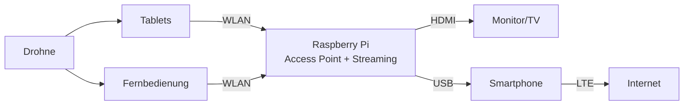

# Mobile Infrastruktur für die Feuerwehr

Dokumentation für den Aufbau einer mobilen IT-Infrastruktur auf Basis eines Raspberry Pi für Feuerwehr-Einsätze.

## 📋 Übersicht

Diese Lösung ermöglicht es Feuerwehren, vor Ort eine mobile WLAN-Infrastruktur bereitzustellen, die folgende Funktionen bietet:

- **WLAN Access Point** für Einsatzkräfte und Geräte
- **Internet-Zugang** (optional via z.B. Mobilfunk)
- **Live-Streaming** von Drohnenbildern auf Monitore und mobile Geräte
- **Container-basierte Erweiterungen** für zusätzliche Dienste
- **Erweiterbar** mit USV, KI-Bildanalyse, Mesh-Netzwerk, externen Antennen

## 🎯 Einsatzszenarien

- Live-Übertragung von Drohnenaufnahmen zur Einsatzleitung
- Vernetzung von Tablets und mobilen Endgeräten am Einsatzort
- Bereitstellung von Streaming-Diensten ohne externe Internet-Abhängigkeit
- Mobile Datenverteilung bei Großschadenslagen

## 🏗️ System-Architektur

## 🛠️ Komponenten

### Hardware
- Raspberry Pi (empfohlen: Pi 4 oder neuer)
- microSD-Karte (mindestens 32 GB)
- Netzteil oder Powerbank (USB-C, 5V/3A)
- Optional: Smartphone für LTE-Tethering
- Optional: HDMI-Monitor/TV

### Software
- Raspberry Pi OS
- hostapd (WLAN Access Point)
- dnsmasq (DHCP/DNS Server)
- Podman (Container Runtime)
- MediaMTX (Streaming Server)

## 🚀 Schnellstart

1. **Rasberry PI konfigurieren**

2. **Access Point konfigurieren**
   - Siehe [Konfigurationsanleitung](docs/config.md)

3. **Streaming-Dienst starten**
   - Siehe [Streaming-Dokumentation](docs/streaming.md)

## 📚 Dokumentation

- [Übersicht & Architektur](docs/overview.md)
- [Konfiguration & Setup](docs/config.md)
- [Streaming-Setup](docs/streaming.md)
- [Hardware-Anforderungen](docs/hardware.md)

## 📝 Lizenz

Dieses Projekt ist unter der MIT-Lizenz lizenziert - siehe [LICENSE](LICENSE) Datei für Details.

## 🤝 Beiträge

Beiträge, Issues und Feature-Requests sind willkommen!

## 👤 Autor

**heoelri**

---

**Hinweis:** Diese Lösung ist für den Einsatz bei Behörden und Organisationen mit Sicherheitsaufgaben (BOS) konzipiert.
