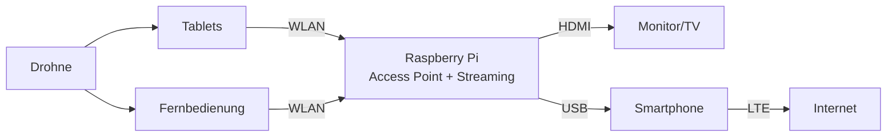

# Systemübersicht - Mobile Feuerwehr-Infrastruktur

## Architektur

Die mobile Infrastruktur basiert auf einem Raspberry Pi, der als zentraler Knotenpunkt für Kommunikation und Datenverteilung dient.

## Systemkomponenten

### 1. Raspberry Pi (Zentrale Einheit)
Der Raspberry Pi fungiert als Herzstück der mobilen Infrastruktur und bietet:

- **WLAN Access Point**: Stellt ein lokales WLAN-Netzwerk (192.168.66.x) bereit
- **Streaming Server**: Läuft containerbasiert (Podman + MediaMTX)
- **DHCP/DNS Server**: Automatische IP-Vergabe und Namensauflösung
- **Bridge-Funktion**: Verbindet WLAN und LAN-Geräte

### 2. WLAN-Netzwerk
- **SSID**: Basierend auf Funkrufnamen des Fahrzeugs (für eindeutige Identifikation bei mehreren Fahrzeugen)
- **Frequenzband**: 5 GHz (802.11ac) für höhere Bandbreite
- **IP-Bereich**: 192.168.66.50 - 192.168.66.150
- **Verschlüsselung**: WPA2-PSK

### 3. Angeschlossene Geräte

#### Drohne
- Sendet Live-Video-Stream an den Raspberry Pi
- Kommuniziert mit Fernbedienung und Tablets
- Stream wird über RTSP/WebRTC bereitgestellt

#### Tablets & Mobile Geräte
- Verbinden sich via WLAN mit dem Raspberry Pi
- Empfangen Live-Streams der Drohne
- Zugriff auf weitere Container-Dienste

#### Monitor/TV
- Anschluss via HDMI
- Zeigt Live-Streams für die Einsatzleitung
- Ermöglicht große Darstellung der Luftaufnahmen

#### Smartphone (Optional)
- Verbindung via USB-Tethering
- Stellt Internet-Zugang via LTE bereit
- Ermöglicht externe Kommunikation wenn nötig

## Datenfluss

### Streaming-Szenario
1. Drohne sendet Video-Stream an Raspberry Pi
2. MediaMTX empfängt und verteilt den Stream
3. Ausgabe erfolgt parallel an:
   - Monitor via HDMI
   - Tablets via WLAN (WebRTC/RTSP)
   - Fernbedienung via WLAN

### Netzwerk-Szenario
1. Geräte verbinden sich mit WLAN Access Point
2. DHCP-Server vergibt automatisch IP-Adressen
3. Bridge ermöglicht Kommunikation zwischen allen Geräten
4. Optional: Internet-Zugang via Smartphone-Tethering

## Vorteile dieser Lösung

✅ **Autark**: Funktioniert ohne externe Infrastruktur  
✅ **Flexibel**: Container-basierte Erweiterungen möglich  
✅ **Mobil**: Kompakte Bauweise, batteriebetrieben möglich  
✅ **Skalierbar**: Mehrere Systeme parallel einsetzbar  
✅ **Kostengünstig**: Basiert auf Standard-Hardware  
✅ **Open Source**: Vollständig auf Open-Source-Software basierend

## Technische Spezifikationen

| Komponente | Details |
|------------|---------|
| Netzwerk | 192.168.66.0/24 |
| Gateway | 192.168.66.1 |
| DHCP-Range | 192.168.66.50 - 192.168.66.150 |
| WLAN-Standard | 802.11ac (5 GHz) |
| Streaming-Protokolle | RTSP, WebRTC, HLS |
| Container-Runtime | Podman |

## Einsatzbeispiele

### Waldbrand-Bekämpfung
- Drohne erfasst Brandausbreitung
- Live-Bilder an Einsatzleitung
- Koordination der Löscharbeiten

### Vermisstensuche
- Drohne scannt großflächiges Gebiet
- Echtzeit-Übertragung an Suchteams
- Schnelle Reaktion bei Sichtung

### Technische Hilfeleistung
- Lagebeurteilung aus der Luft
- Planung der Rettungsmaßnahmen
- Dokumentation des Einsatzes

## Weiterführende Dokumentation

- [Konfiguration & Setup](config.md) - Detaillierte Installationsanleitung
- [Streaming-Konfiguration](streaming.md) - MediaMTX Container-Setup
- [Hardware-Anforderungen](hardware.md) - Einkaufsliste und Spezifikationen
- [Erweiterungsmöglichkeiten](extensions.md) - USV/Akkus, KI, Mesh-Netzwerk, externe Antennen

## 🔧 Mögliche Erweiterungen

Das System kann je nach Einsatzbedarf erweitert werden:

### Stromversorgung
- **USV-Systeme**: PiJuice HAT, externe LiFePO4-Akkus
- **Solar-Integration**: 50-100W Panels für längere Einsätze
- **Fahrzeugintegration**: Direkte 12V-Bordnetz-Anbindung
- **Laufzeit**: Bis zu 60+ Stunden mit großen Akkus

### WLAN-Reichweite
- **Externe Antennen**: 9-19 dBi Rundstrahler oder Richtantennen
- **USB-WLAN-Adapter**: ALFA AWUS036ACH für 500m+ Reichweite
- **Mehrband-Setup**: Gleichzeitige Nutzung von 2.4 GHz und 5 GHz
- **Professionelle APs**: Ubiquiti oder MikroTik für extreme Reichweiten

### Mesh-Netzwerk
- **B.A.T.M.A.N. Advanced**: Linux-natives Mesh-Protokoll
- **802.11s**: Standard WLAN-Mesh
- **Ubiquiti UniFi Mesh**: Kommerzielle Plug-and-Play-Lösung
- **Anwendung**: Großflächige Einsätze mit mehreren Fahrzeugen

### KI-Integration
- **TensorFlow Lite**: Objekterkennung, Personen-/Fahrzeugerkennung
- **Google Coral TPU**: Hardware-beschleunigte AI (100+ FPS)
- **Anwendungen**: 
  - Automatische Rauch-/Feuererkennung
  - Personenzählung bei Großveranstaltungen
  - Kennzeichenerkennung
  - Vermisstensuche mit Gesichtserkennung

### Monitoring & Sensoren
- **Prometheus + Grafana**: Echtzeit-Systemüberwachung
- **Umwelt-Sensoren**: Temperatur, Luftqualität, Feinstaub
- **GPS-Integration**: Positionsbestimmung und Tracking
- **Cloud-Synchronisation**: Automatisches Backup via rclone

Detaillierte Informationen zu allen Erweiterungen finden Sie in der [Erweiterungs-Dokumentation](extensions.md).